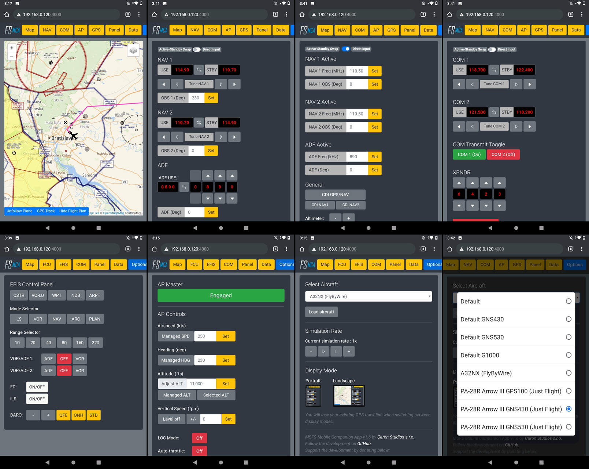

# MSFS Mobile Companion App
MSFS Mobile Companion App is a tool that allows you to control essential aircraft instruments such as NAV/COM frequencies, autopilot or lights using almost any mobile device. The MSFS Mobile Companion App is free to use.

Screenshot of MSFS Mobile Companion App in action:

### MSFS Mobile Companion App features:

- Moving map (Open Street Maps).
- Load flight plan into the map.
- NAV 1/2 frequency and OBS 1/2 selection.
- ADF frequency and ADF card selection.
- COM 1/2 and transponder selection.
- Autopilot with altitude, vertical speed, and airspeed settings.
- GPS controls.
- Gyro drift and altimeter pressure settings.
- Light controls.
- Pitot heat and deicing controls.
- Landing ratings (vertical speed at touchdown).
- Simulation rate controls.

### Supported Controls Profiles
MSFS Mobile Companion App has built-in support for the following aircraft:
- Default GNS430/530 and G1000 (to be used with default MSFS planes and other third-party planes without dedicated controls profiles)
- A32NX by FlyByWire
- PA-28R Arrow III (GPS100, GNS430/530) by Just Flight

## Update Mar/29/2021 Version 1.6 Changelog:

- Added aircraft controls profile selection
- Added controls profiles for GNS430/530, G1000, A32NX (FBW), and PA-28R (Just Flight)
- Added integration with Mobiflight WASM
- Added Data tab with IAS, ALT, HDG data
- Added Sync HDG bug to current heading
- Added yaw damper AP controls
- Fixed NAV frequency display UI for iOS (padding for NAV frequency display)

## How do I install MSFS Mobile Companion App?
1. Download the latest build [here](https://github.com/mracko/MSFS-Mobile-Companion-App/releases/).
2. That's it.

## How do I run MSFS Mobile Companion App?
**Don't install the app on your mobile device. Download and run it on your PC. This creates a local web server to which you connect from your mobile device via an IP address.**
1. Copy the **mobiflight-event-module** folder into the Community folder of Microsoft Flight Simulator. The MobiFlight WASM Module allows the app to access additional cockpit switches. You will find the Community folder under:
   - MS Store users: C:\Users\YOURUSERNAME\AppData\Local\Packages\Microsoft.FlightSimulator_8wekyb3d8bbwe\LocalCache\Packages
   - Steam users: C:\Users\YOURUSERNAME\AppData\Roaming\Microsoft Flight Simulator\Packages\
2. Open the **settings.txt** file, that you’ve unzipped together with the MSFS_MCA_v1-6.exe and this guide, and change the last line to reflect your Microsoft Flight Simulator installation folder. This step is only necessary if you wish to use the Load Flight Plan functionality. Hint:
   - MS Store users: C:\Users\YOURUSERNAME\AppData\Local\Packages\Microsoft.FlightSimulator_8wekyb3d8bbwe\
   - Steam users: C:\Users\YOURUSERNAME\AppData\Roaming\Microsoft Flight Simulator\
3. Make sure your PC and your mobile device are connected to the same local network and that your home network is set to *Private* in your Network Profile settings. You can find a short guide on how to set your network to private [here](https://support.microsoft.com/en-us/windows/make-a-wi-fi-network-public-or-private-in-windows-10-0460117d-8d3e-a7ac-f003-7a0da607448d). 
4. Start a flight in Microsoft Flight Simulator.
5. Run MSFS_MCA_v1-6.exe that you've unzipped previously.
6. A Microsoft Defender security window may open when launching MSFS_MCA_v1-6.exe for the first time. Allow the "unrecognized app" to run. Additionally, a Windows Security Alert Window may open when you launch MSFS_MCA_v1-6.exe for the first time. Allow private network access for MSFS_MCA_v1-6.exe in the Windows Security Alert Window.
7. A command line window will open that will give you instructions on the IP-address where you can access the MSFS Mobile Companion App. Don't close the command line window.
8. Open the IP-address in your mobile device's web browser. The IP address will most likely be something like *192.168.0.XXX:4000*.

*Notice: You can launch MSFS Mobile Companion App directly from your PC's browser. In that case, just type in localhost:4000 in your browser's url bar.* 

## Known issues:
- Changes to COM frequencies in the A320 will not be shown in the cockpit but will work nevertheless. To force an update of the frequency in the cockpit switch from VHF1 to VHF2 and then back to VHF1 (this is for COM1 frequencies).
- When using the Load Flight Plan button without having a waypoint programmed in your plane’s GPS, you might see a dashed violet line pointing towards 0,0 GPS coordinates or to your last GPS waypoint from your previous flight.
- NAV frequencies can get out of sync, especially when rapidly pressing frequency adjustment buttons. Use the "Force Sync Frequencies" button to synchronize frequencies with the sim.
- NAV frequencies may not automatically synchronize when starting a second flight. Use the "Force Sync Frequencies" button to synchronize frequencies with the sim.
- You may see landings with a vertical speed between 0 and 5 fpm in the app. This is caused by the sim recording the plane loading on the ground at the start of a flight as a landing.
- The app may not work on a fresh Windows 10 installation. You may see a "Could not find MSFS running. Please launch MSFS first and then restart the MSFS 2020 Mobile Companion App." message even if MSFS is running. To fix this, please download and install the Microsoft Visual C++ 2015 Redistributable.

## Credits
MSFS Mobile Companion App is based on the Python [SimConnect](https://pypi.org/project/SimConnect/) project. The app uses [MobiFlight’s](https://www.mobiflight.com/en/index.html) WASM Event Module to access additional switches and buttons which aren’t accessible via standard SimConnect. I would like to thank [Just Flight](https://www.justflight.com/) for providing a copy of the PA-28R Arrow III.

## Donation
If you like this tool and would like to support the development, please consider donating by clicking on the link below.

Happy flying!
